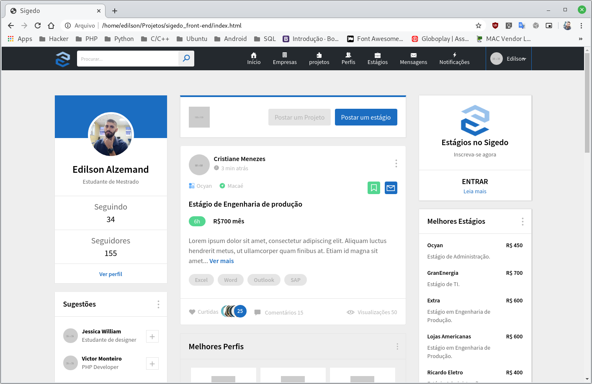

# sigedo

Sistema de gerenciamento de estágio

1. INTRODUÇÃO

especificar e implementar um sistema que seja capaz de otimizar a rotina de estágio dentro da instituição, bem como aproximar alunos e empresas interessadas em estagiários, empregados e serviços do contexto acadêmico. O projeto envolve a combinação de perfis e necessidades de empresas da região com perfis de alunos e serviços que a universidade pode oferecer. Com isso, a expectativa é que o projeto contribua para que o conceito de estágio seja de fato um instrumento de integração entre teoria, prática e formação profissional. Considerando ainda que o conceito de estágio bem feito envolve planejamento, execução, acompanhamento e avaliação de conformidade com o currículo, um sistema de informação será capaz de contribuir essencialmente para essa tarefa. Além disso, a ampliação da interatividade entre oferta e procura em um ambiente virtual, favorecerá a relação entre empresas, alunos, professores e projetos acadêmicos, muito além de simplesmente ofertar vagas de estágios.

